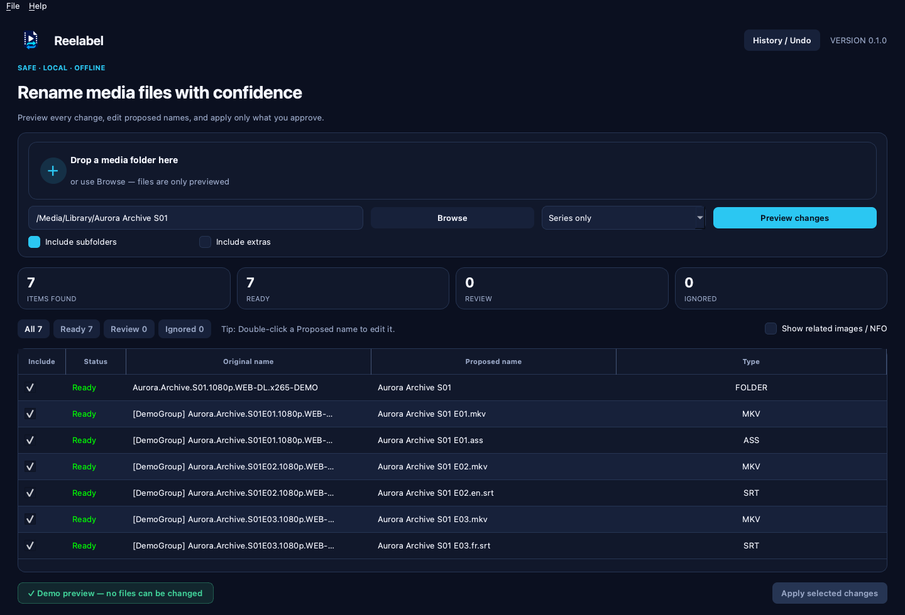

<p align="center">
  
</p>

<h1 align="center">Reelabel</h1>

<p align="center">
  <a href="https://github.com/ares-projects-H/reelabel/actions/workflows/ci.yml"></a>
  <a href="LICENSE"></a>
</p>

Reelabel is a safe, privacy-focused desktop utility for cleaning the names of
movie, series, and subtitle files, as well as their containing release folders.
It always previews proposed changes first, preserves media contents, and
refuses ambiguous or conflicting operations.

> Current release: v0.1.0.
> The installers are unsigned, so begin with a copied test folder.
> The next feature version, v0.2.0, is under development.

## Interface preview


### Fictional series example

All media and folder names in this preview are invented for demonstration:



Reelabel includes:

- folder selection and drag-and-drop;
- movie, series, recursion, and extras options;
- a cancellable background scan;
- an editable before/after preview with working Ready, Review, and Ignored filters;
- preview columns that can be resized by dragging and sorted by clicking their
  headers;
- native application menus and local appearance/scan-default settings;
- an optional update check that contacts GitHub only after an explicit click;
- proposed names that can be edited by double-clicking a cell in the
  **Proposed name** column;
- editable folder-name proposals for movies, series, and other media collections;
- optional same-folder propagation after correcting a title or season pattern
  in one episode proposal;
- optional propagation of a corrected movie title to its related subtitle files;
- cross-platform filename, extension, path, and collision validation;
- partial selection and all-or-nothing rename application;
- app-data history with safe Undo;
- related image/NFO deletion shown only when requested, unchecked by default,
  and protected by a second confirmation.

## Install the app

Download the current package for your platform from the
[latest GitHub release](https://github.com/ares-projects-H/reelabel/releases/latest):

- Windows 10/11 x64: installer EXE;
- macOS Apple Silicon or Intel: the matching DMG;
- Ubuntu 24.04 x86_64: DEB package (recommended);
- other Linux x86_64 distributions: portable AppImage.

The first release is unsigned, so Windows SmartScreen or macOS Gatekeeper may
show a warning. Before opening the download, compare it with
`SHA256SUMS.txt`. The [step-by-step installation guide](docs/installation.md)
explains how to do this on each system. The
[signing roadmap](docs/signing-roadmap.md) documents future Windows and macOS
publisher signing without claiming that it is active today.

## First use in eight steps

1. Open Reelabel.
2. Drag a media folder into the window, or click **Browse**.
3. Choose **All media**, **Movies only**, or **Series only**.
4. Click **Preview changes**. No files are changed during this step.
5. Review every row. Uncheck anything you do not want to rename.
6. To correct a suggestion, double-click its cell in the **Proposed name**
   column, type the new name, and press Enter.
7. Click **Apply selected changes** only when the preview is correct.
8. To restore the previous names, open **History / Undo**.

For explanations of every option, preview status, batch-edit question, and
safety warning, read the [first-time user guide](docs/user-guide.md).

## Settings

On macOS, use **Reelabel → Preferences…** in the system menu bar. This opens
the **Reelabel Settings** screen. On Windows and Linux, use
**File → Settings…** in the application window.

Reelabel can remember the System/Light/Dark appearance, conservative scan
defaults, and whether to show the rename confirmation. Choosing
**Don't show again** in that confirmation can be reversed in Settings.
Destination validation, automatic restoration, History / Undo, and the
separate image/NFO deletion confirmation are never disabled by this option.
Settings remain local and cannot enable analytics, background networking, or
automatic updates. **Help → Check for Updates…** and the button in Settings
contact the official GitHub release page only when clicked. Reelabel never
downloads or installs an update automatically. See the [privacy policy](PRIVACY.md).

## Run from source for development

You do not need this section to use an installer. It is intended for people who
want to modify the source code.

```bash
python -m venv .venv
source .venv/bin/activate
python -m pip install -e ".[dev]"
reelabel-gui
```

On Windows, activate the environment with `.venv\Scripts\activate`.
Only source development requires Python; packaged users do not need Python or
Codex.

## Optional command line

Reelabel also provides a command-line workflow for users who prefer a
terminal:

```bash
reelabel --dry-run "/path/to/media"
reelabel --apply "/path/to/media"
reelabel --undo "/path/to/rename_undo_TIMESTAMP.json" \
  --undo-scope "/path/to/original-media-folder"
```

Related images and NFO files are never proposed unless
`--delete-sidecars` is passed explicitly.
`--undo-scope` is required so a history file cannot restore anything outside
the media folder you explicitly authorize.

## Safety principles

- No analytics, telemetry, or background network access.
- The optional update check sends no filenames or settings and runs only after
  an explicit click.
- No media content changes.
- Folder renames are always previewed, editable, and individually selectable.
- No overwriting existing files.
- No automatic image/NFO deletion.
- Conflicts and uncertain subtitle matches are reported instead of guessed.
- An apply failure triggers automatic restoration of already staged renames.

## Contributing and security

Contributions are welcome. Read [CONTRIBUTING.md](CONTRIBUTING.md) before
opening a pull request. A contribution cannot change the official application
until the owner has reviewed and merged it. Reelabel is maintained in personal
time, so reviews may take several days or longer.

Please report security problems privately using the instructions in
[SECURITY.md](SECURITY.md). Maintainers can follow the
[safe GitHub review and release guide](docs/maintainer-guide.md).
Reelabel's local data and manual update behavior are documented in
[PRIVACY.md](PRIVACY.md).

## Contributors

Community contributors are credited after their changes are merged:

<a href="https://github.com/ares-projects-H/reelabel/graphs/contributors">
  
</a>

## License

Copyright © 2026 ares-projects-H.

Reelabel is licensed under the [MIT License](LICENSE). The Reelabel name and
logo identify the official project; see [TRADEMARKS.md](TRADEMARKS.md) for
branding guidelines for forks and redistributions.

---

Designed, tested, and maintained by a human, with substantial development
assistance from OpenAI Codex.
