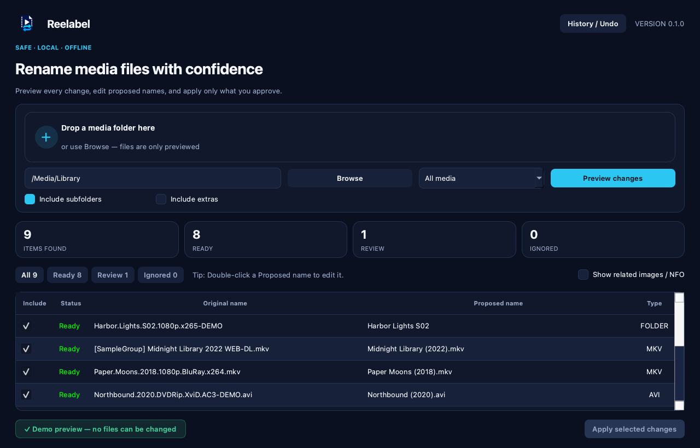

<p align="center">
  
</p>

<h1 align="center">Reelabel</h1>

<p align="center">
  <a href="https://github.com/ares-projects-H/reelabel/actions/workflows/ci.yml"></a>
  <a href="LICENSE"></a>
</p>

Reelabel is a safe, offline desktop utility for cleaning the names of
movie, series, and subtitle files, as well as their containing release folders.
It always previews proposed changes first, preserves media contents, and
refuses ambiguous or conflicting operations.

> Current milestone: private installer testing before publication. Version
> 0.1.0 is unsigned, so begin with a copied test folder.

## Interface preview



Reelabel includes:

- folder selection and drag-and-drop;
- movie, series, recursion, and extras options;
- a cancellable background scan;
- an editable before/after preview with working Ready, Review, and Ignored filters;
- preview columns that can be resized by dragging and sorted by clicking their
  headers;
- proposed names that can be edited by double-clicking a cell in the
  **Proposed name** column;
- editable folder-name proposals for movies, series, and other media collections;
- optional same-folder propagation after correcting a title or season pattern
  in one episode proposal;
- optional propagation of a corrected movie title to its related subtitle files;
- cross-platform filename, extension, path, and collision validation;
- partial selection and all-or-nothing rename application;
- app-data history with safe Undo;
- related image/NFO deletion shown only when requested, unchecked by default,
  and protected by a second confirmation.

## Install the app

When version 0.1.0 is published, download the package for your platform from the
[latest GitHub release](https://github.com/ares-projects-H/reelabel/releases/latest):

- Windows 10/11 x64: installer EXE;
- macOS Apple Silicon or Intel: the matching DMG;
- Ubuntu 24.04 x86_64: DEB package (recommended);
- other Linux x86_64 distributions: portable AppImage.

The first release is unsigned, so Windows SmartScreen or macOS Gatekeeper may
show a warning. Before opening the download, compare it with
`SHA256SUMS.txt`. The [step-by-step installation guide](docs/installation.md)
explains how to do this on each system.

## First use in eight steps

1. Open Reelabel.
2. Drag a media folder into the window, or click **Browse**.
3. Choose **All media**, **Movies only**, or **Series only**.
4. Click **Preview changes**. No files are changed during this step.
5. Review every row. Uncheck anything you do not want to rename.
6. To correct a suggestion, double-click its cell in the **Proposed name**
   column, type the new name, and press Enter.
7. Click **Apply selected changes** only when the preview is correct.
8. To restore the previous names, open **History / Undo**.

For explanations of every option, preview status, batch-edit question, and
safety warning, read the [first-time user guide](docs/user-guide.md).

## Run from source for development

You do not need this section to use an installer. It is intended for people who
want to modify the source code.

```bash
python -m venv .venv
source .venv/bin/activate
python -m pip install -e ".[dev]"
reelabel-gui
```

On Windows, activate the environment with `.venv\Scripts\activate`.
Only source development requires Python; packaged users do not need Python or
Codex.

## Optional command line

Reelabel also provides a command-line workflow for users who prefer a
terminal:

```bash
reelabel --dry-run "/path/to/media"
reelabel --apply "/path/to/media"
reelabel --undo "/path/to/rename_undo_TIMESTAMP.json"
```

Related images and NFO files are never proposed unless
`--delete-sidecars` is passed explicitly.

## Safety principles

- No Internet access or analytics.
- No media content changes.
- Folder renames are always previewed, editable, and individually selectable.
- No overwriting existing files.
- No automatic image/NFO deletion.
- Conflicts and uncertain subtitle matches are reported instead of guessed.
- An apply failure triggers automatic restoration of already staged renames.

## Contributing and security

Contributions are welcome. Read [CONTRIBUTING.md](CONTRIBUTING.md) before
opening a pull request. A contribution cannot change the official application
until the owner has reviewed and merged it.

Please report security problems privately using the instructions in
[SECURITY.md](SECURITY.md). Maintainers can follow the
[safe GitHub review and release guide](docs/maintainer-guide.md).

## Support Reelabel

Reelabel will remain free and open source. If it saves you time, you can
optionally support its maintenance through
[GitHub Sponsors](https://github.com/sponsors/ares-projects-H). Sponsorship
does not unlock features or affect which contributions are accepted.

## License

Copyright © 2026 ares-projects-H.

Reelabel is free software licensed under the
[GNU General Public License v3.0 or later](LICENSE).
