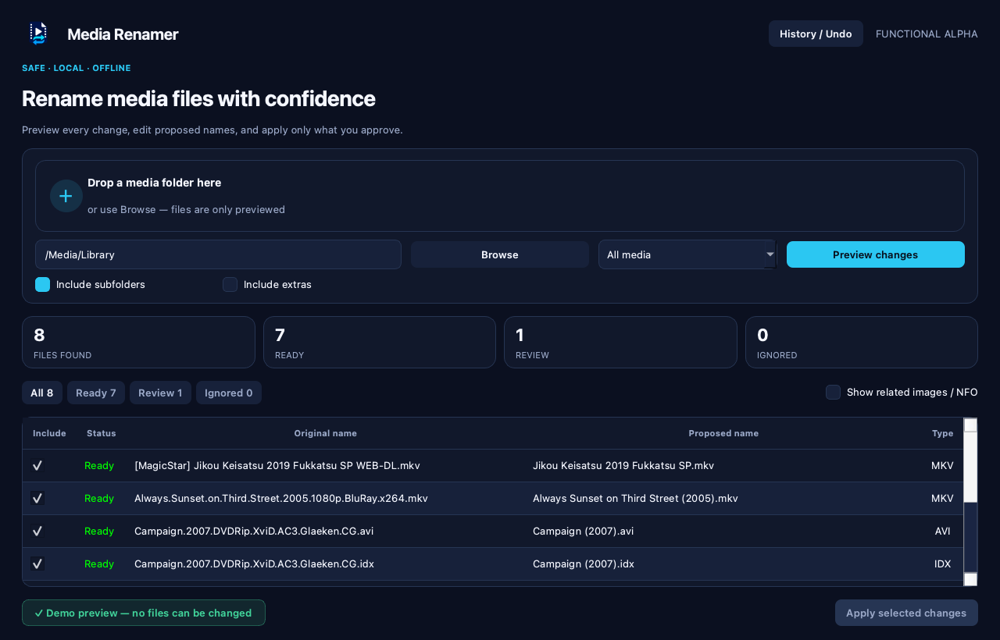

# Media Renamer

Media Renamer is a safe, offline desktop utility for cleaning movie, series,
subtitle filenames, and their containing release folders. It always previews
proposed changes first, preserves media contents, and refuses ambiguous or
conflicting operations.

> Current milestone: packaging and publication (validation 3). Version 0.1.0
> is an unsigned public alpha, so begin with a copied test folder.

## Interface preview



The functional alpha includes:

- folder selection and drag-and-drop;
- movie, series, recursion, and extras options;
- a cancellable background scan;
- an editable before/after preview with working Ready, Review, and Ignored filters;
- editable folder-name proposals for movies, series, and other media collections;
- optional same-folder propagation after correcting a title or season pattern
  in one episode proposal;
- cross-platform filename, extension, path, and collision validation;
- partial selection and all-or-nothing rename application;
- app-data history with safe Undo;
- related image/NFO deletion shown only when requested, unchecked by default,
  and protected by a second confirmation.

## Install

Download the package for your platform from the
[latest GitHub release](https://github.com/ares-projects-H/media-renamer/releases/latest):

- Windows 10/11 x64: installer EXE;
- macOS Apple Silicon or Intel: the matching DMG;
- Linux x86_64: AppImage.

The first release is unsigned, so Windows SmartScreen or macOS Gatekeeper may
show a warning. Check the download against `SHA256SUMS.txt` and follow the
[installation guide](docs/installation.md).

## Run from source

```bash
python -m venv .venv
source .venv/bin/activate
python -m pip install -e ".[dev]"
media-renamer-gui
```

On Windows, activate the environment with `.venv\Scripts\activate`.
Only source development requires Python; packaged users do not need Python or
Codex.

## Command line

The original conservative command-line workflow is retained:

```bash
media-renamer --dry-run "/path/to/media"
media-renamer --apply "/path/to/media"
media-renamer --undo "/path/to/rename_undo_TIMESTAMP.json"
```

Related images and NFO files are never proposed unless
`--delete-sidecars` is passed explicitly.

## Safety principles

- No Internet access or analytics.
- No media content changes.
- Folder renames are always previewed, editable, and individually selectable.
- No overwriting existing files.
- No automatic image/NFO deletion.
- Conflicts and uncertain subtitle matches are reported instead of guessed.
- An apply failure triggers automatic restoration of already staged renames.

## Project checkpoints

- [Validation 1 — interface prototype](docs/validation-1.md)
- [Validation 2 — functional alpha](docs/validation-2.md)
- [Validation 3 — installers and GitHub release](docs/validation-3.md)

## Contributing and security

Contributions are welcome. Read [CONTRIBUTING.md](CONTRIBUTING.md) before
opening a pull request. Please report security problems privately using the
instructions in [SECURITY.md](SECURITY.md).

## License

Media Renamer is available under the [MIT License](LICENSE).
