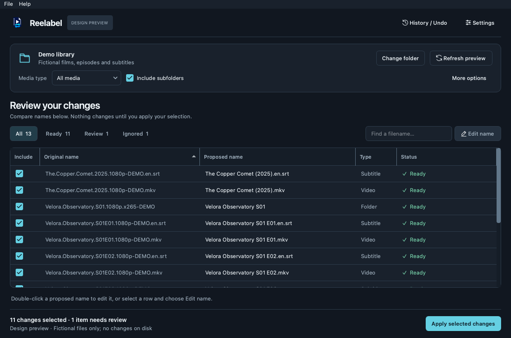

# Modern interface — validation 1

The owner approved this direction (Validation 1). The original study below is
retained as design evidence, not as a new Reelabel release. See the
[implementation and test report](implementation.md) for the production changes.

At the time of this study, the production application, rename engine, settings,
history, packaging, and GitHub configuration had not been changed. The prototype uses invented names
and in-memory actions only. Its Apply, Undo, folder selection, and update check
are simulations, not working replacements for those production features.

## Review the proposal



- [Light preview](preview-light.png)
- [Compact window](compact-dark.png)
- [Empty state](empty-light.png)
- [Light Settings](settings-light.png) / [Dark Settings](settings-dark.png)
- [Light confirmation](confirmation-light.png) / [Dark confirmation](confirmation-dark.png)
- [Light History / Undo](history-light.png) / [Dark History / Undo](history-dark.png)

The screenshots are rendered from real PySide6 widgets on macOS using Qt's
offscreen platform. Native window decorations and the macOS global menu bar are
not included. They are not screenshots of Windows or Linux builds.

Run the interactive study from the repository root using the existing development
environment:

```sh
.venv/bin/python docs/design/modern-interface/preview.py
```

On Windows, the corresponding interpreter is `.venv\Scripts\python.exe`.
The installed Reelabel application is unchanged. Closing the study discards its
temporary preferences and edited example names.

## Audit: issues in priority order

Baseline: clean, synchronized `main` at `f85fde2`; work isolated on
`feature/modern-interface`. The existing macOS bundle was opened for inspection;
source windows and dialogs were also exercised using temporary media and settings.
An independent read-only code/test audit complemented the main review.

### 1. Keep the displayed folder and preview bound together

**Confirmed code path and probe.** After scanning folder A, choosing folder B only
updates the path field. Apply still uses A's report. Destination protections still
exist, but the interface can give a misleading impression of the operation's
target. See `MainWindow._set_folder` and `_apply_selected` in
`src/reelabel/gui/main_window.py` (baseline lines 876 and 1515).

Proposed correction: invalidate or clearly mark the preview as outdated whenever
the source folder or scan options change. Disable Apply until a new scan completes.
Keep the exact scanned root visible in the confirmation. Add a regression test
covering browse, drag-and-drop, direct path edits, and option changes.

### 2. Make table editing intentional and easy to discover

**Confirmed.** Status and Type cells inherit editable flags; only the original name
is explicitly made read-only. Proposed-name editing is available mainly through
double-click. See `_add_row` (baseline lines 1060–1107).

Proposed correction: explicitly define flags for every column; provide Edit name,
double-click, and a keyboard route. Preserve source-path identity when sorting,
filtering, editing, or selecting rows. Keep optional related-file propagation.
Conflict rows currently excluded by the engine must not become applicable simply
because the UI changes.

### 3. Improve visual hierarchy, contrast, and small-window behavior

**Observed and confirmed in styles.** The large introduction, drop zone, summary
cards, and repeated filter counts compete with the actual filenames. Ready/Review
colors use fixed bright green/yellow independently of theme. Some light-theme
selection/button color combinations need contrast correction. System appearance
is sampled when applying settings, rather than subscribed to for live changes.

Proposed correction: one compact source panel, one filter/count row, more room for
the table, semantic theme colors, visible resize dividers, and consistent dialog
styling. Scroll Settings on smaller displays; bound dropdown widths. Maintain
visible focus, selected, disabled, and hover states without relying on color alone.

### 4. Separate operation state and make errors recoverable

**Review risks, not all reproduced failures.** Update feedback restores an older
main status message, potentially overwriting a newer scan message. History parsing
assumes JSON objects/lists of the expected shape. Concurrent scan/history actions
and window teardown need stronger tests. Apply/Undo are synchronous, and full
table validation/rebuilds may be expensive on large libraries; performance needs
measurement before choosing an optimization.

Proposed correction: separate scan/update/history state, validate history shapes,
handle unavailable entries, serialize file-changing operations, and test closing,
cancellation, retry, and overlapping commands. Preserve non-cancellable application
and rollback once a rename transaction begins. Keep both update entry points and
the existing QAction boolean-argument fix.

### 5. Improve test evidence and maintenance boundaries

**Confirmed coverage limits.** The current 76 tests pass, but some visual checks
assert stylesheet text/minimum dimensions rather than visible fit. Full GUI
Apply → History → Undo, sorted/filtered partial selections, lifecycle edge cases,
and malformed history need additional coverage. The 1,701-line main window mixes
layout, state, validation, batch transforms, and dialogs.

Extract focused modules incrementally rather than rewriting the engine. The README
still labels v0.1.0 as current; correct it during implementation. Existing package
smoke checks do not replace installing and testing the exact candidate installers.

## Proposed visual direction

- **Identity:** keep Reelabel's existing logo; neutral slate surfaces and a restrained
  teal accent. No remote fonts, web components, decorative gradients, or copied brand.
- **Typography:** Qt's native system font; body 13 logical pixels, section titles
  24, restrained semibold labels. Verify actual platform font metrics when packaged.
- **Spacing:** a small 4/8/12/16/24 scale, approximately 36-pixel action controls and
  40-pixel rows. Reduce secondary headings when vertical space is limited.
- **Components:** shared tokens for surface, text, accent, warning, success, focus,
  divider, and disabled states; text/icon status labels, visible checkbox outlines.
- **Source:** folder summary and preview action together; basic media/recursion
  options always visible, extras/related-file controls under More options.
- **Preview:** one set of filters/counts, a local filename filter, explicit Edit name,
  resizable/sortable columns, full-name tooltips, and a persistent selection summary.
- **Settings:** grouped Appearance, Scan defaults, Confirmations, and Updates;
  System/Light/Dark buttons avoid a cramped theme dropdown. The body scrolls without
  stretching media choices across an enlarged dialog.
- **Feedback:** context next to the affected operation, understandable empty/busy/error
  states, and readable confirmation/undo dialogs. Keep deletion separate from rename.

| Token | Light | Dark |
| --- | --- | --- |
| Background | `#F4F6F8` | `#111720` |
| Surface | `#FFFFFF` | `#19212C` |
| Main text | `#182733` | `#EDF3F7` |
| Secondary text | `#536674` | `#A1B1BF` |
| Accent | `#08778B` | `#65D0E3` |
| Column divider | `#9DAEBB` | `#617689` |

These are candidate design tokens, not a claim of a completed accessibility audit.

## Implementation sequence after approval

1. **Safety/state tests first:** reproduce the stale-preview and editable-metadata
   defects, establish stable source identifiers, and cover operation lifecycle edges.
2. **Theme and reusable components:** central tokens, native fonts, appearance
   controller, icons, focus states, bounded dropdowns, and consistent dialogs.
3. **Preview workspace:** compact layout and extracted table/controller; preserve
   resizing, sorting, edits, related-file propagation, selection, and folder renames.
4. **Settings, History, updates:** focused modules with explicit state ownership;
   robust history parsing and independently tested Help/Settings update routes.
5. **Integrated verification:** complete pytest/Ruff, real temporary-file
   Apply → Undo, cancellation and simulated failures, large-library responsiveness,
   network isolation, light/dark/system, modest sizes and 125/150/200% display scale.
6. **Handoff:** update public documentation with fictional screenshots, verify the
   branch, prepare a draft PR and candidate builds. Validate the actual EXE, both
   DMGs, DEB and AppImage, recording unsupported test machines honestly.

Keep `scan`, `validate_edits`, `apply`, and `undo` unchanged unless a separately
explained defect makes a targeted fix necessary. No framework migration or new
runtime dependency is proposed. Any required SVG assets must be included and
tested in the PyInstaller bundle.

No merge, tag, release, signature activation, or GitHub security-setting change is
authorized by this design study. Manual Windows/macOS/Ubuntu validation precedes
any later request for publication approval.

## Evidence and limits of validation 1

- Existing production suite: **76 passed**; Ruff passed.
- Prototype: **5 checks passed** at each simulated Qt scale factor
  **100%, 125%, 150%, and 200%** (20 executions). This checks interaction and
  widget geometry; it does not prove native OS scaling or screen-reader behavior.
- Rendered and inspected light/dark main, empty, compact, settings, confirmation,
  and history examples. Corrected prototype checkbox/arrow visibility and disabled
  primary styling during inspection.
- Prototype checks cover filters/search, editable flags, stale-preview state,
  cancellation, bounded Settings dropdowns/scrolling, theme selection, dialogs,
  simulated update feedback, and compact action placement.
- The prototype does **not** connect to GitHub, import the rename engine, access
  user media/history/preferences, or apply/undo anything. Its example version labels
  are illustrative; production keeps its existing single version source.
- No production package was rebuilt. Native Windows/Linux, Intel macOS, real
  platform scaling, large-library performance, and assistive technology remain to
  be validated during implementation.

Reproduce the study checks:

```sh
QT_QPA_PLATFORM=offscreen .venv/bin/python -m pytest docs/design/modern-interface/test_preview.py -q
QT_QPA_PLATFORM=offscreen QT_SCALE_FACTOR=1.5 .venv/bin/python -m pytest docs/design/modern-interface/test_preview.py -q
QT_QPA_PLATFORM=offscreen .venv/bin/python docs/design/modern-interface/preview.py --capture
```

Validation 1 is approved. Candidate installers still require the owner's manual
validation before any merge or publication.
