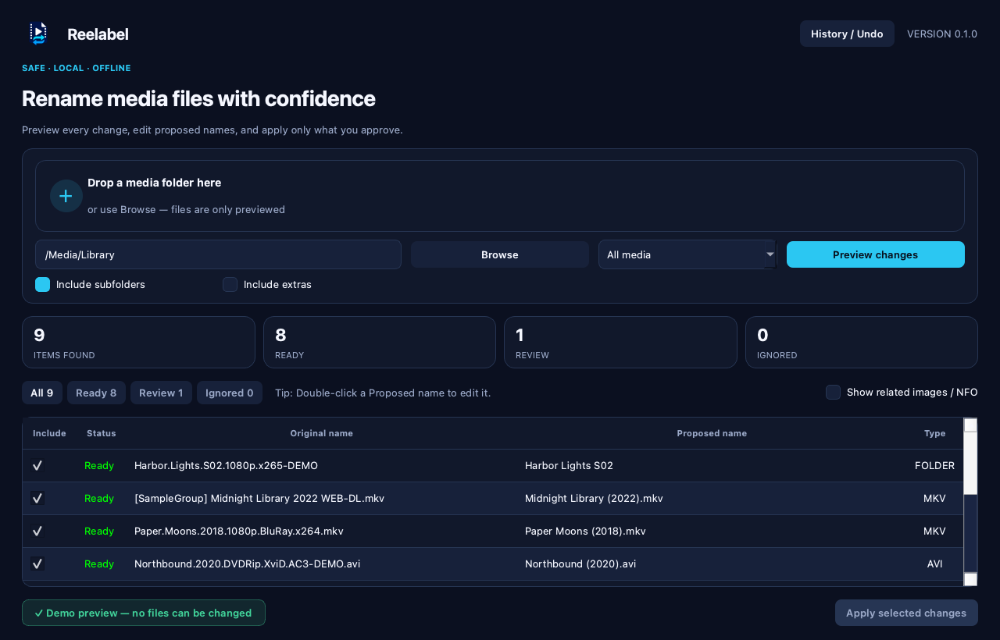

# Validation 1 — Interface prototype

This checkpoint deliberately separates visual review from file-changing
behavior. The PySide6 interface has been implemented, while its Apply action
remains disabled until the working application is approved.

## Decisions represented

- A single folder-first workflow instead of several setup screens.
- Fictitious movie, episode, and subtitle examples in the preview.
- Editable proposed filenames.
- Related image/NFO handling visible but off by default.
- Clear Ready, Review, and Ignored states.
- An explicit notice that prototype mode cannot change files.
- A dark system-style theme with a compact table for large libraries.

## Safety checks

- The Apply button is disabled.
- The image/NFO checkbox starts unchecked.
- No network feature or analytics is present.
- The first engine regression suite passes independently of PySide6.

## Next checkpoint

After visual approval, validation 2 connects the interface to the engine,
adds path and conflict validation, performs scans in a worker, and implements
history-backed apply and undo behavior.
