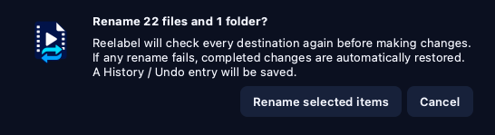

# Validation 2 — Working application

This completed checkpoint connected the approved interface to the local rename
engine. It documents the working application behavior that was verified before
standalone packaging began.

## What now works

- Choose or drop a media folder and run a read-only scan.
- Cancel a long scan without changing files.
- Filter the table with All, Ready, Review, and Ignored.
- Uncheck individual proposals or double-click a cell in the **Proposed name**
  column to edit it.
- Preview, edit, or uncheck cleaned movie, series, and collection folder names.
- Correct a title or season pattern in one episode and optionally propagate it
  to the other files in that same folder while preserving episode numbers and
  subtitle suffixes.
- Revalidate edits for unsupported Windows characters, reserved names,
  changed extensions, existing destinations, case collisions, duplicate
  destinations, and missing source files.
- Apply selected valid renames as one transaction.
- Restore renamed files from History / Undo when their original paths are free.
- Optionally show related image/NFO files. They remain unchecked by default and
  require a separate permanent-deletion confirmation.

## Suggested validation

Always begin with a copied test folder.

1. Open the app and choose the copied folder.
2. Select the correct media type and click **Preview changes**.
3. Click each status filter and confirm that only matching rows remain visible.
4. Uncheck one Ready row. Then double-click another row in the **Proposed
   name** column, type a correction, and press Enter.
5. For a series, correct the title or remove an incorrect season from one
   episode and review the offered same-folder updates.
6. Review the proposed folder name.
7. Click **Apply selected changes** and verify only checked items changed.
8. Open **History / Undo**, select the latest entry, and restore it.
9. Run a second preview and confirm the original file and folder names returned.

## Confirmation

The apply confirmation uses the Reelabel logo for better contrast in dark
mode, explains the safety behavior in plain language, and offers **Don't show
again**. The reminder can be restored in Settings without disabling
destination checks, rollback, History / Undo, or the separate image/NFO
deletion confirmation.

## Checkpoint outcome

The source application passed this checkpoint. Standalone Windows, macOS, and
Ubuntu packages were subsequently built and tested without requiring Python or
Codex on the user's computer; those packages are tracked in validation 3.
